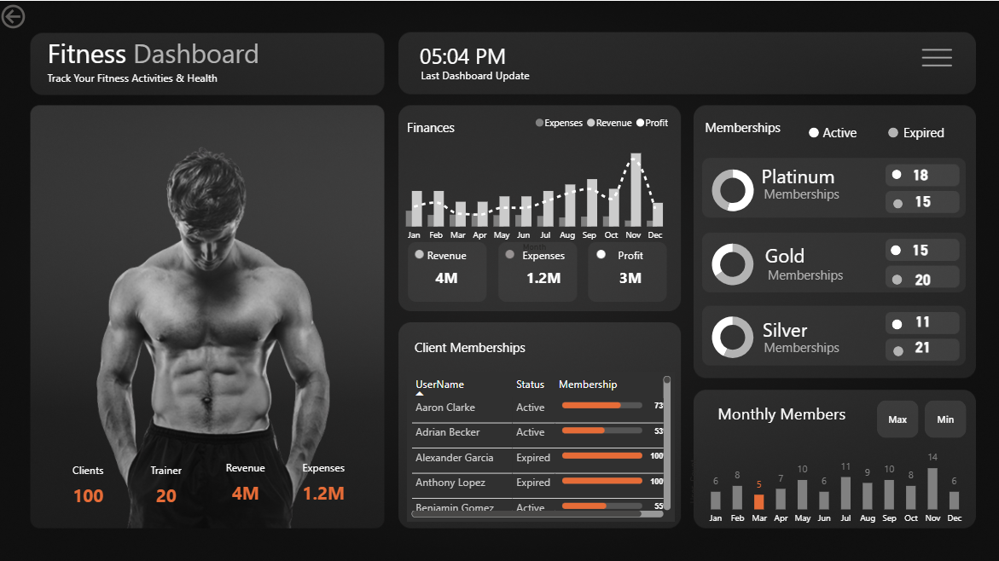

# Fitness Business Perfomance Dashboard (Power BI)

## 📌 Project Overview
This project analyzes fitness business data using **Power BI** to uncover insights into revenue, expenses, user growth, and profitability.  

The dashboard provides:
- **Key KPIs**: Revenue, Expenses, Profit, User Growth  
- **Monthly Trends** of active users and revenue  
- **Profitability Analysis** across different categories  
- **Interactive Filters** for deep dive  

---

## 📊 Dashboard Preview

---

## 🛠️ Tools & Skills Used
- Power BI (Data Modeling, DAX, Visualization)
- Data Cleaning & Transformation (Power Query)
- Analytical storytelling

---

## 📂 Files in this Repo
- `Fitness_BI_Project.pbix` → Main Power BI Dashboard
- `dashboard_overview.png` → Preview of the dashboard
- `README.md` → Documentation

---

## 🚀 How to Use
1. Download the `.pbix` file.
2. Open in **Power BI Desktop**.
3. Explore the interactive dashboard.

---

## 💡 Key Insights
- Revenue increased steadily over months while expenses fluctuated.
- Profitability is strongly correlated with user engagement.
- Identified seasonal patterns in user activity.

---

## 👨‍💻 Author
**Mohammed Rafiq**  
Aspiring Data Analyst | Power BI | SQL | Python  
[LinkedIn Profile](#) | [Portfolio Website](#)  
